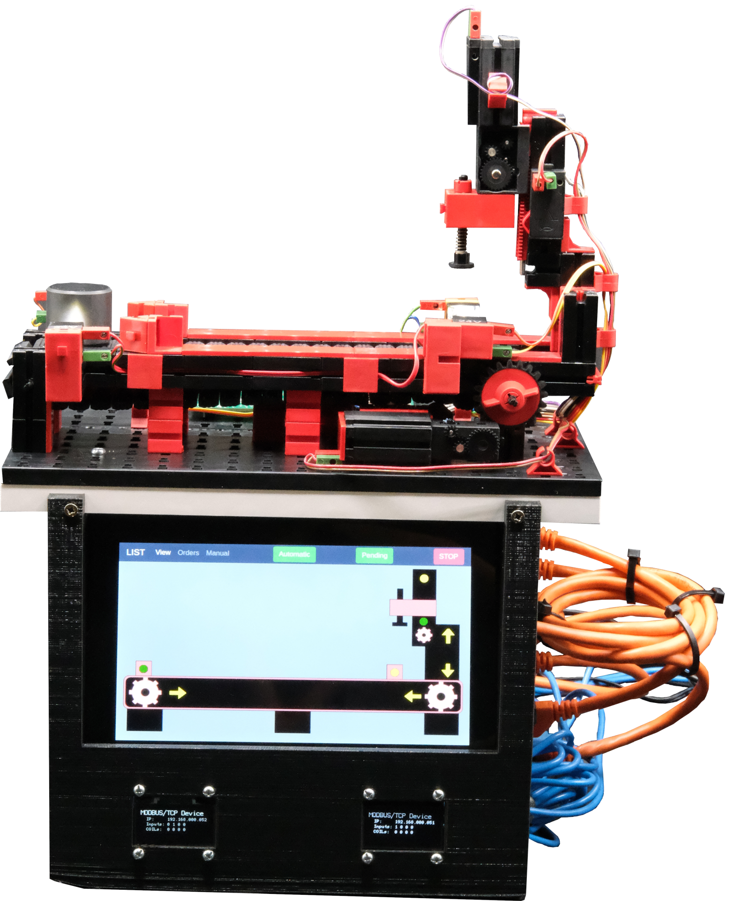

# Low-cost ICS Testbed

The project aims to help setup a minimal, low-cost *Industrial Control System (ICS)* testbest for students,
researchers, or anyone with an interest in industrial security.
The project contains a list of affordable hardware to build the minimalistic ICS with, instructions,
configurations and installation scripts to instantiate the system as well as various attacker scenarios and their implications.

<table align="center"><tr><td align="center" width="9999">
</img>
</td></tr></table>

Our goal is to ease the entry into the industrial security sector.
Industrial hardware is usually quite expensive as well as mostly proprietary, both of which do not encourage easy learning.
With the upcoming of Industry 4.0, however,
it has become imperative that the security of industrial networks and components is up to par with the modern cyber
risks of the connected world.
Practice and knowledge has to be accessible and affordable to empower engineers and
developers to master the challenges of the fourth industrial revolution.

Although the testbed only comprises of the bare minimum components necessary for an ICS, the concepts and more
importantly, the attack scenarios are mostly the same. 

## Setup with simple Fischertechnik model
The picture shows the setup of the testbed with the HMI and the physical process.
<table align="center"><tr><td align="center" width="9999">
</img>
</td></tr></table>

## LICSTER video series

## Testbed parameters
This project was set up with the following requirements in mind:
* Testbed components for about 500 Euro, 
  which is affordable by most researchers and
  students.
* A real-world physical process controlled by
  an ICS, which enables to demonstrate and
  analyze the impacts of cyber attacks in the
  real-world.
* The components are open-source and
  open-hardware, as far as possible. This
  allows a wide range of further research.
* We provide attacker models and attacks
  to understand threat scenarios in industrial
  environments.
* The feasibility of the testbed is shown and
  ideas for further research and teaching is
  discussed.

## Content
* [Devices](devices/README.md)
* [Attacks](attacks/README.md)
* [Images](images/README.md)
* [Tools](tools/README.md)
* [Network captures](network_captures/README.md)

## Components
* [HMI](devices/hmi/README.md)
* [PLC](devices/plc/README.md)
* [scada](devices/scada/README.md)
* [Remote IO](devices/remote_io/README.md)
* [3d-printed Case](devices/case/README.md).

## Prerequisites
We try to keep the prerequisites as little as possible to reduce the hurdle for beginners.

## Licenses
* OpenPLC is licensed under GPL-3.0
* CubeMX generated code for STM32 is copyrighted by STMicroelectronics
* ScadaLTS is licensed under MIT License 

# Getting started
At the beginning you may be a bit confused by the many different components.
However, the assembly is not as difficult as expected.

1. Ordering the necessary components ([click](devices/README.md))
2. Assembly and wiring (to-do)
3. Programming the devices ([stm32](devices/remote_io/software/README.md)/[RPI](https://github.com/hsainnos/LICSTER/releases))
4. Testing LICSTER
5. Have fun and make the world more secure 

# Contributers

|Name                   |Contribution                                  | 
|-----------------------|----------------------------------------------|
|Matthias Niedermaier   |Maintainer                                    |
|Felix Sauer            |Developer                                     |
|Susanne Kießling       |Learning concepts                             |
|Dominik Merli          |Coordinator                                   |
|Fabian Klemm           |Secure webapplication for HMI                 |
|Eric Hoffmann          |Intrusion detection system                    |
|Raphael Hausmanninger  |Secure communication between PLC and Remote-IO|
|Michael Janzer         |Intrusion detection system                    |
|Muhammet Bilbey        |Secure communication between PLC and Remote-IO|
|Athanasios Luludis     |Secure webapplication for HMI                 |
|Janis Schickram        |Intrusion detection system                    |

# Paper
You find the research paper [here](https://www.scienceopen.com/document?vid=4fa78131-80f5-4fca-b45a-bfd6a04ae2cc). To
cite the work you can use the official bibtex entry:

<pre>
@article{ScienceOpenVid:4fa78131-80f5-4fca-b45a-bfd6a04ae2cc,\
    author = {Sauer, Felix and Niedermaier, Matthias and Kießling, Susanne and Merli, Dominik},\
    title = {LICSTER – A Low-cost ICS Security Testbed for Education and Research},\
    journal = {},\
    year = 2019,\
    volume = {},\
    number = {},\
    pages = {1-10},\
    doi = {10.14236/ewic/icscsr19.1}\
}
</pre>

