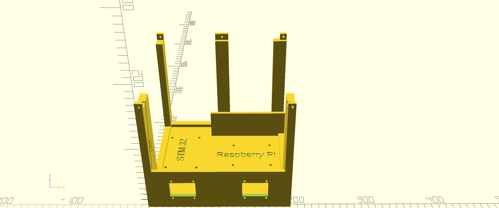

# 3d Printed Case (Testing)

The 3d printed housing for the LICSTER testbed is currently only for **testing** purposes.

<table align="center"><tr><td align="center" width="9999">
</img>
</td></tr></table>

## Current Printer Settings for Draft Purposes

| Parameter          | Option                        |
|--------------------|-------------------------------|
| Printer            | Creality 3D Ender-3           |
| Layer height       | 0.28 mm                       |
| Generate support   | yes                           |
| Infill density     | 20%                           |

Print time for this is about 30 hours.

