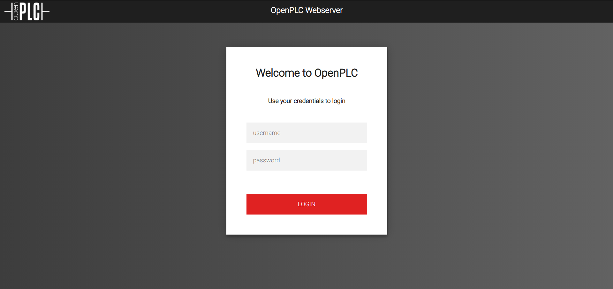
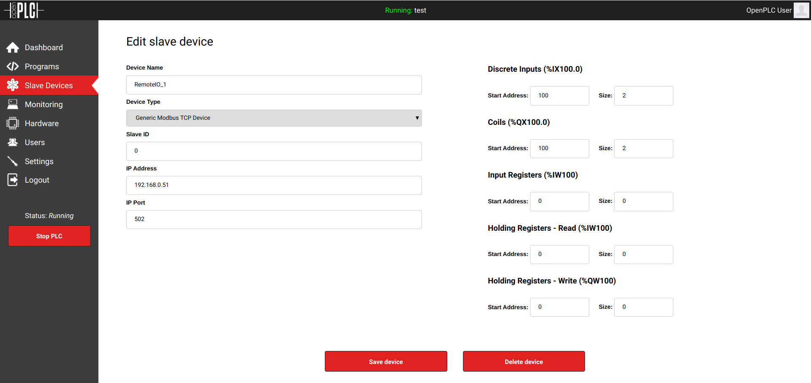
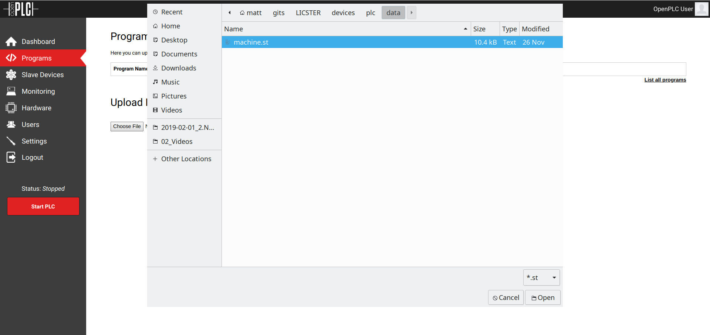
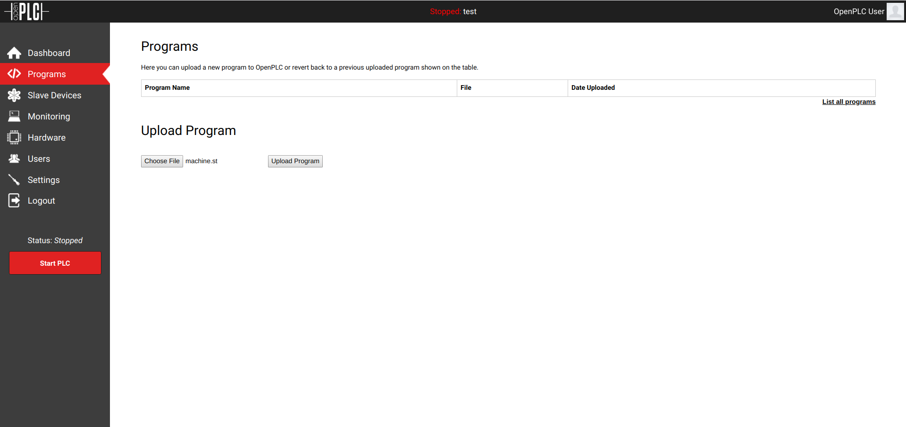
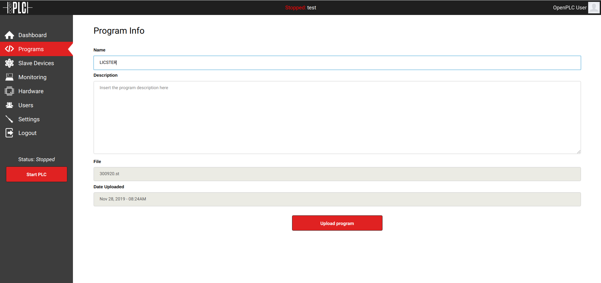
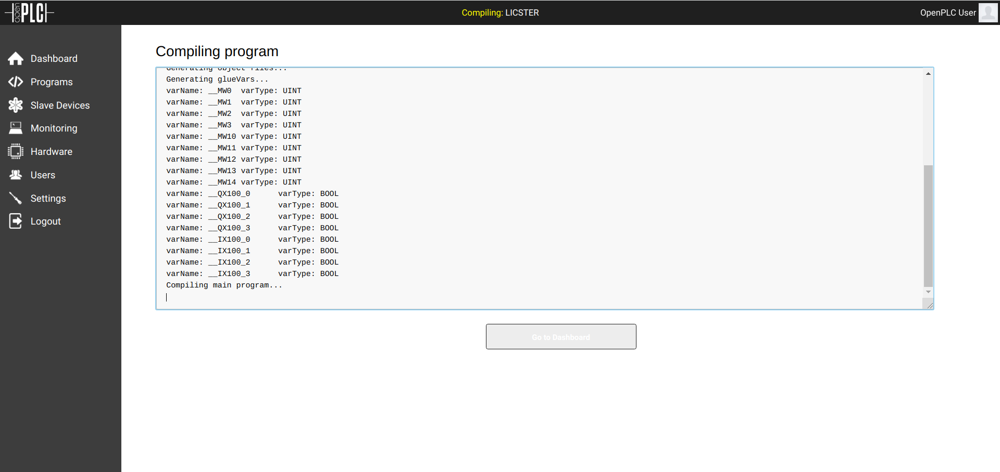
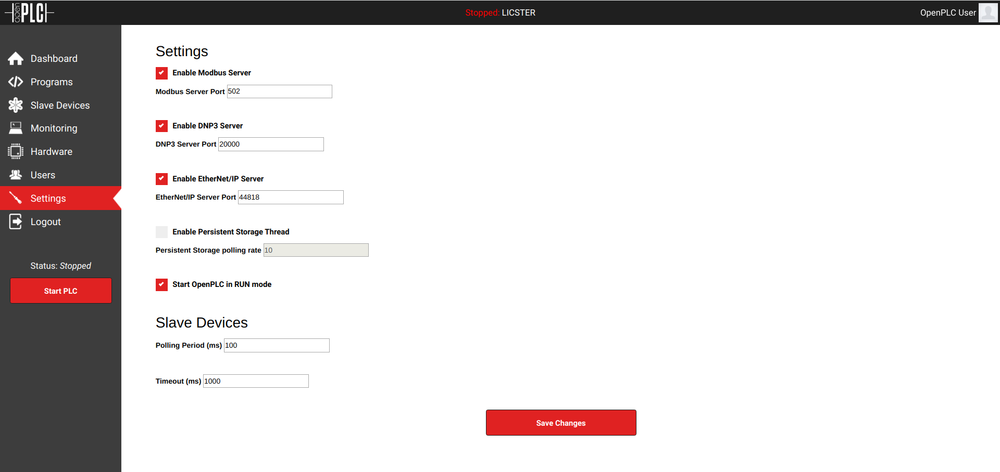
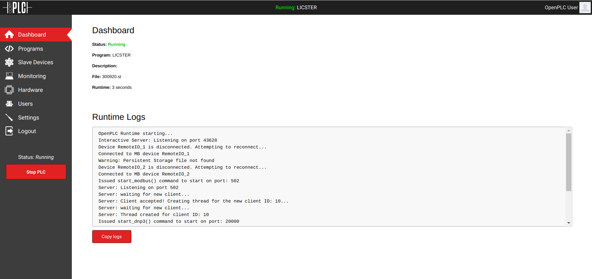
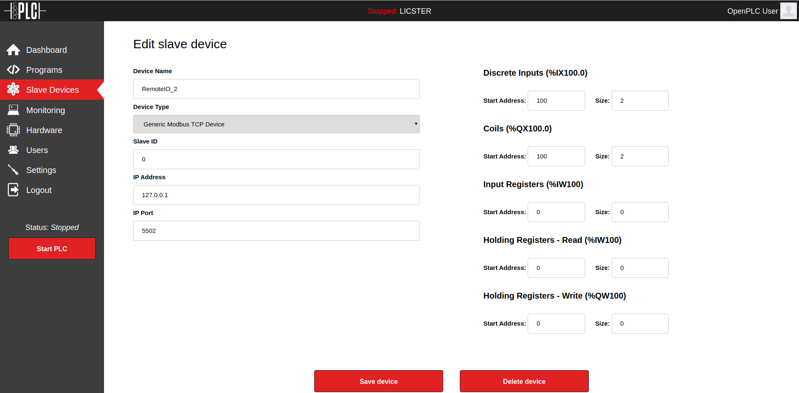
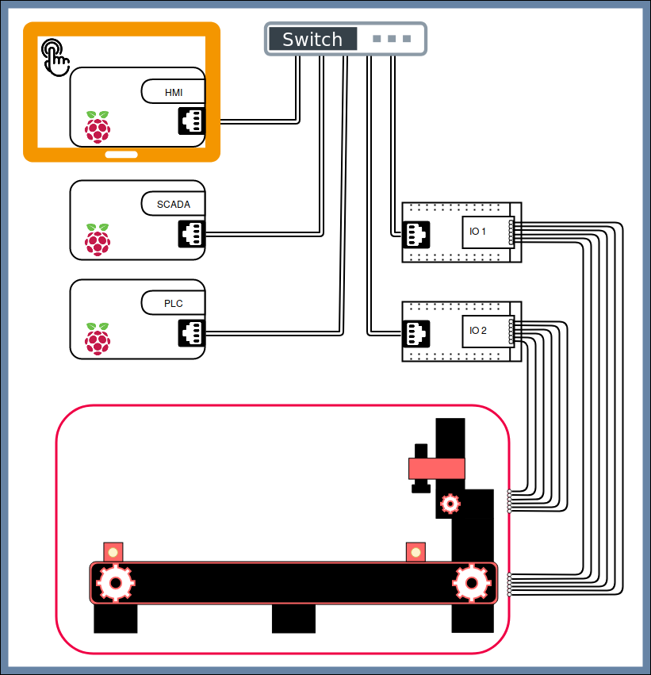

# Programmable Logic Controller (PLC)
This section will briefly describe what a PLC is and it is a key component for production environments and then focus on
the setup of the Soft-PLC used for this testbed and the program that it executes. This page is structured as follows:

1. [PLC Basics](#plc-basics)
    1. [What is a PLC?](#what-is-a-plc?)
    2. [What is a Soft-PLC?](#what-is-a-soft-plc?)
2. [The PLC as the heart of our testbed](#the-plc-as-the-heart-of-our-testbed)
    1. [Setup](#setup)
    2. [Running the OpenPLC](#running-the-openplc)
    3. [Running the OpenPLC in TLS mode](#running-the-openplc-in-tls-mode)
    4. [Structure](#structure)

## PLC Basics
As the successor of traditional relay circuits, which are basically switches that can be toggled electrically, the PLC
has become indispensable for our industrialized world. They control production plants as well as critical
infrastructures such as water and power supply. The PLC is the interface between the virtual world of software and the
physical world of signals and circuits. The fact that is is deployed almost everywhere makes it the Achilles tendon of
many machines, plants and infrastructures.

### What is a PLC?
Typically, a PLC is designed to endure even in rough industrial environments. It has a small form factor so it can be
mounted on top-hat-rails. A PLC consists out of a CPU, memory and said inputs and outputs. Further it has a series of
digital and or analogue inputs and outputs that are controlled by its internal logic, i.e. the implemented program.
These programs are very low level an run close to the actual hardware. Without the need for a full-fledged operating
system, a PLC does not requires less computing power. Especially the lack of a scheduler, a central component of
operating systems that splits the processing power between all processes, allows PLCs to meet industrial real-time
requirements.

### What is a Soft-PLC?
A regular PLC is software and hardware molded together inseparably. A Soft-PLC is the software of a PLC on its own, which
then can be installed on various hardware platforms. Depending on the underlying hardware, the Soft-PLC has more or
fewer inputs and outputs, computing power or other interfaces. This makes PLCs much more flexible and more affordable
due to open-source software and inexpensive hardware of one's choosing. 

## The PLC as heart of the testbed
One of the fundamental requirements for this project is to keep all components open-source and affordable. Out of these
reasons we decided to use a Raspberry Pi as hardware platform to host the Soft-PLC
[OpenPLC](https://openplcproject.com). 

### Setup
This project provides fully installed and configured Raspberry Pi images under [releases](https://github.com/hsainnos/LICSTER/releases). However, if you want to install your system yourself, go on and follow the instructions on this page. First you need to load a raspian image onto a SD card and boot your Raspberry Pi from it. Once you have a shell, you first need to configure the network connections.

### Network
Statically configure the IP address of the Raspberry Pi in the `/etc/network/interfaces`.

```zsh
sudo nano /etc/network/interfaces
```

Eventually your file should look like this:

```
# interfaces(5) file used by ifup(8) and ifdown(8)

# Please note that this file is written to be used with dhcpcd
# For static IP, consult /etc/dhcpcd.conf and 'man dhcpcd.conf'

# Include files from /etc/network/interfaces.d:
source-directory /etc/network/interfaces.d

auto lo eth0 eth0:0
iface lo inet loopback

iface eth0 inet dhcp

iface eth0:0 inet static
    address 192.168.0.30
    netmask 255.255.255.0

```

It will set up two interfaces. The `eth0:0` as the device needed for the communication within the testbed and the `eth0` as your default connection to the internet. Should you have a WiFi interface and intend to configure that as the internet connection change the folloing two lines in the `/etc/network/interfaces` configuration.

```
# interfaces(5) file used by ifup(8) and ifdown(8)

# Please note that this file is written to be used with dhcpcd
# For static IP, consult /etc/dhcpcd.conf and 'man dhcpcd.conf'

# Include files from /etc/network/interfaces.d:
source-directory /etc/network/interfaces.d

auto lo eth0 eth0:0 wifi0       #   <---
iface lo inet loopback

iface eth0 inet dhcp
iface wifi0 inet dhcp           #   <---

iface eth0:0 inet static
    address 192.168.0.30
    netmask 255.255.255.0

```
This assumes that your WiFi interface is called `wifi0`. You can validate that with the command `ip link` which lists all network interfaces. Shoud the name differ, simply write the correct name in place of `wifi0`. In case that you want to configure your WiFi network statically, just adapt the WiFi config to how `eth0:0` is set up.


### Fetching Dependencies
For the sake of simplicity, create a folder called gits in your home directory and change your working directory into it.
```zsh
cd $HOME
mkdir gits
cd gits
```

Clone the OpenPLCv3 git repository.
```zsh
git clone https://github.com/thiagoralves/OpenPLC_v3.git
```

Change into the OpenPLCv3 folder.
```zsh
cd OpenPLC_v3/
```

### Installation
To install OpenPLCv3 for Linux, simply type the command:
```zsh
./install.sh linux
```
### Running the OpenPLC
Open your browser and go to http://192.168.0.30:8080/ and log in with the default credentials *username*: openplc *password*: openplc.

<table align="center"><tr><td align="center" width="9999">
</img>
</td></tr></table>

Carefully configure the OpenPLC exactly as in the screenshots below. Small differences can later cause trouble in the communication between the devices.

<table align="center"><tr><td align="center" width="9999">
</img>
</td></tr></table>

<table align="center"><tr><td align="center" width="9999">
</img>
</td></tr></table>

Unter the `Programs` tab you can upload your ST project. Should you already have uploaded a project before, we advise to delete it before trying to replace it with the new one. Otherwise it can cause trouble.

<table align="center"><tr><td align="center" width="9999">
</img>
</td></tr></table>

Select your ST project from your local machine.

<table align="center"><tr><td align="center" width="9999">
</img>
</td></tr></table>

Hit upload.

<table align="center"><tr><td align="center" width="9999">
</img>
</td></tr></table>

Give the project a sensible name and a description if needed.

<table align="center"><tr><td align="center" width="9999">
</img>
</td></tr></table>

Hit upload again and your ST project will be compiled by the OpenPLC. Keep your eyes on the console output. It will propmt compilation errors.

<table align="center"><tr><td align="center" width="9999">
</img>
</td></tr></table>

Before you start the PLC, configure these final settings.

<table align="center"><tr><td align="center" width="9999">
</img>
</td></tr></table>

Start the PLC and check if status properly switches to *running*. Again, skim through the console output for potential problems.

<table align="center"><tr><td align="center" width="9999">
</img>
</td></tr></table>

Now your OpenPLC is up and running!

### Running the OpenPLC in TLS mode
Follow the same instructions as in [Running the OpenPLC](#running-the-openplc), but use the following configuration for the Slave Devices:

<table align="center"><tr><td align="center" width="9999">
</img>
</td></tr></table>

<table align="center"><tr><td align="center" width="9999">
</img>
</td></tr></table>

### Structure
<table align="center"><tr><td align="center" width="9999">
</img>
</td></tr></table>

