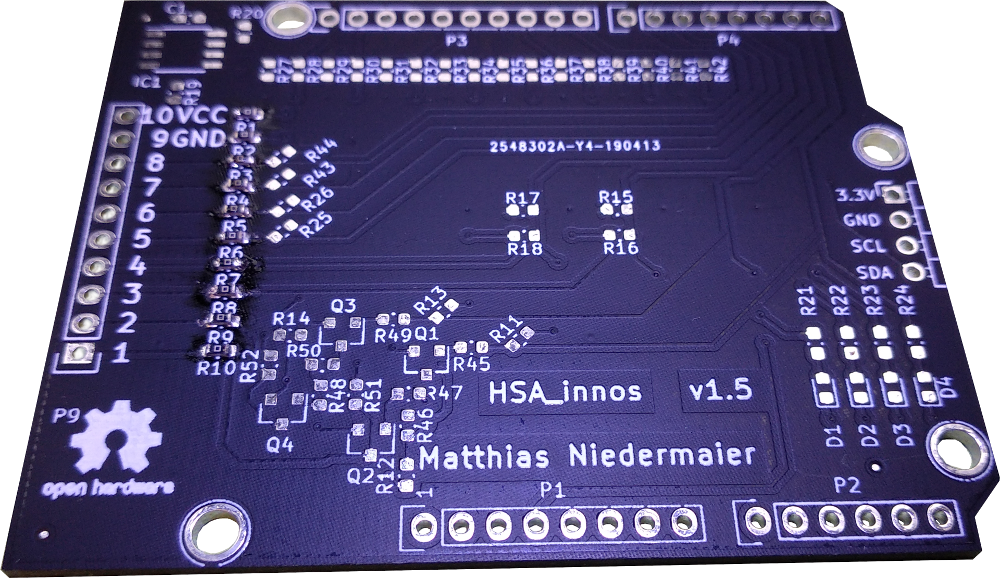
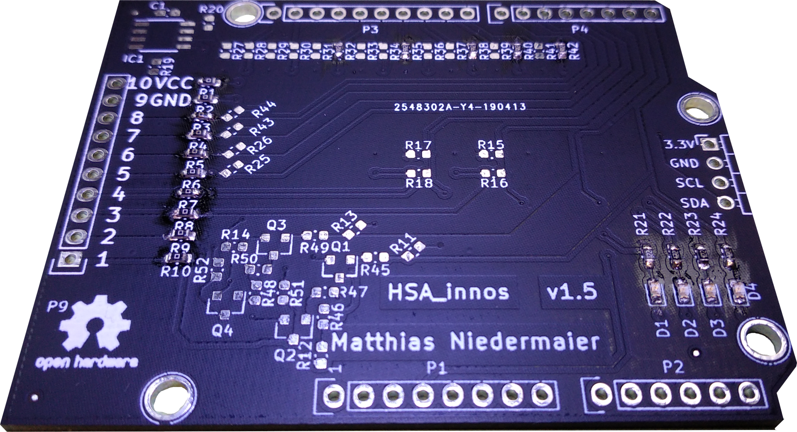
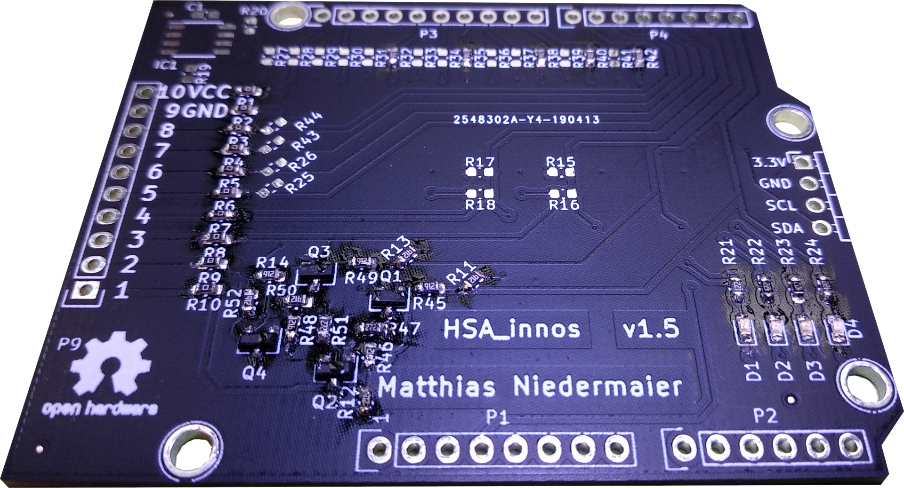
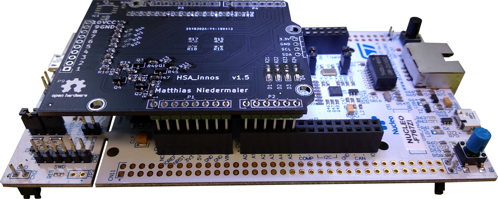
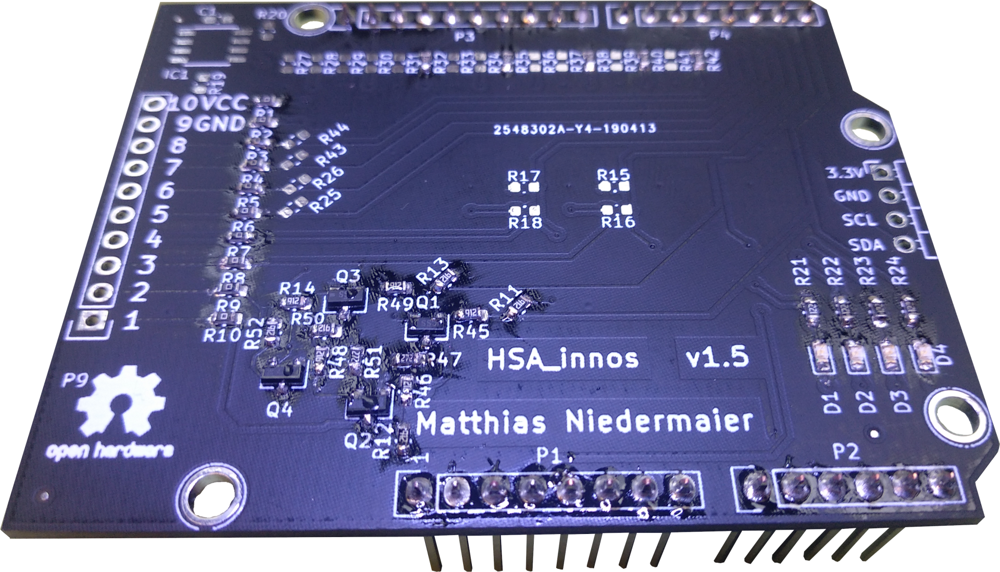

# Low-cost ICS Testbed - Remote IO

## PCB Components

Setting up the PCBs for the two remote IOs is an easy two step process. First you order the PCB and the components, as
described below, and then it takes some basic soldering skills to put it together. This is the most basic, cheap and fun
way to do it. Yet there [alternatives][0.0], should that not appeal to you.

[0.0]: #alternatives

# List of PCB Components

| Label        | Name                                         | Amount single | Total | Description           |
|--------------|----------------------------------------------|--------|-------|-----------------------|
C1             | 0603 100nF Capacitor                         | 1      | 2     | Optional[1](#myfootnote1)              |
D1-D4          | 0603 LED                                     | 4      | 8     |                       |
C1             | ATECC508A OIC-8_3.9x4.9mm_P1.27mm	          | 1      | 2     |  Optional[1](#myfootnote1)              |
J1             | PinHeader_1x04_P2.54mm_Horizontal            | 1      | 2     |                       |
P1             | Socket_Arduino_Uno:Socket_Strip_Arduino_1x08 | 1      | 2     |                       |
P2             | Socket_Arduino_Uno:Socket_Strip_Arduino_1x06 | 1      | 2     |                       |
P3             | Socket_Arduino_Uno:Socket_Strip_Arduino_1x10 | 1      | 2     |                       |
P4             | Socket_Arduino_Uno:Socket_Strip_Arduino_1x08 | 1      | 2     |                       |
P9	           | Pin_Headers:Pin_Header_Straight_1x10 2.54mm  | 1      | 2     |                       |
Q1, Q3         | BSS138 Package_TO_SOT_SMD:SOT-23             | 2      | 4     |                       |
Q2, Q4         | BSS83P Package_TO_SOT_SMD:SOT-23             | 2      | 4     |                       |
R1,R2,R7-R10   | 0R Resistor_SMD:R_0603_1608Metric            | 6      | 12    |                       |
R3-R6          | 10k Resistor_SMD:R_0603_1608Metric           | 6      | 12    |                       |
R25,R26,R43,R44| 1.5k Resistor_SMD:R_0603_1608Metric          | 4      | 4     |                       |
R21-R24        | 1k Resistor_SMD:R_0603_1608Metric            | 4      | 4     |                       |
R11-R14, R19, R20, R27-R42, R45, R46, R48-R50, R52 | 10 Resistor_SMD:R_0603_1608Metric | 28  | 56   |  |
R47, R51       | 2k2 Resistor_SMD:R_0603_1608Metric           | 2      | 4     |                       |

## Component Ordering

A possible distributor for the PCB components is [mouser](https://mouser.com/).
Important: The amount is only for one PCB.

| Mouser-No.             | Man.- Nr.           | Description                                                                         | Amount | Price (EUR) | Price total: (EUR) |
|------------------------|---------------------|-------------------------------------------------------------------------------------|--------|-------------|--------------------|
| 963-HMJ107BB7104KAHT   | HMJ107BB7104KAHT    | Multilayer Ceramic Capacitors MLCC - SMD/SMT 0603 100VDC 0.1uF 10% X7R SFT AEC-Q200 | 1      | 0,09 €      | 0,09 €             |
| 710-150060BS55040      | 150060BS55040       | Standard LEDs - SMD WL-SMCD SMD Mono SMD 0603 Blue 465nm                            | 4      | 0,153 €     | 0,61 €             |
| 556-ATECC508A-SSHCZT	 | ATECC508A-SSHCZ-T   | Security ICs / Authentication ICs ECDH/ECC 10Kb 8ld SOIC SWI, T&R                   | 1      | 0,675 €     | 0,68 €             |
| 571-825433-4           | 825433-4            | MOD 2 PINHDR 1X4 P.	                                                             | 1      | 0,729 €     | 0,73 €             |
| 571-825433-8           | 825433-8            | MOD 2 PINHDR 1X8 P.	                                                             | 2      | 2,06 €      | 4,12 €             |
| 571-825433-6           | 825433-6            | MOD 2 PINHDR 1X6 P.                                                                 | 1      | 1,69 €     | 1,69 €             |
| 571-1-825433-0         | 1-825433-0          | MOD 2 PINHDR 1X10 P.                                                                | 1      | 1,21 €      | 1,21 €             |
| 651-1725737            | 1725737             | 10P 2.54mm 90DE                                                                     | 1      | 7,11 €      | 7,11 €             | 
| 863-BSS138LT7G         | BSS138LT7G          | MOSFET NFET SOT23 50V 200MA 3.5O                                                    | 2      | 0,225 €     | 0,45 €             |
| 726-BSS83PH6327        | BSS83P H6327        | MOSFET P-Ch SOT-23-3                                                                | 2      | 0,378 €     | 0,76 €             |
| 71-CRCW06030000Z0EAC   | CRCW06030000Z0EAC   | Thick Film Resistors - SMD 1/10Watt 0ohms Commercial Use                            | 10     | 0,025 €     | 0,25 €             |
| 71-CRCW06031K00FKEAC   | CRCW06031K00FKEAC   | Thick Film Resistors - SMD 1/10Watt 1Kohms 1% Commercial Use                        | 4      | 0,09 €      | 0,36 €             |
| 71-CRCW060310K0FKEAC   | CRCW060310K0FKEAC   | Thick Film Resistors - SMD 1/10Watt 10Kohms 1% Commercial Use                       | 28     | 0,054 €     | 1,51 €             |
| 71-CRCW06031K50FKEAC   | CRCW06031K50FKEAC   | Thick Film Resistors - SMD 1/10Watt 1.5Kohms 1% Commercial Use                      | 4      | 0,09 €      | 0,36 €             |
| 71-CRCW06032K20FKEAC   | CRCW06032K20FKEAC   | Thick Film Resistors - SMD 1/10Watt 2.2Kohms 1% Commercial Use                      | 2      | 0,09 €      | 0,18 €             |

## PCB Ordering

For our LICSTER prototypes we ordered the PCB at [JLCPCB][1.0]. They are fast and cheap, though any
other PCB producer will do just as well. In the folder [Fabrication][1.1] you find all the files
needed to order the PCB. In the case of JLCPCB, you need only zip them together and upload them to [upload][1.2].
After you uploaded the files, you can choose the color of the PCB, while all other functional requirements are already
set. Please note, that at JLCPCB the minimum amount of PCBs you can order is five.

[1.0]: https://jlcpcb.com/
[1.1]: hardware/Fabrication
[1.2]: https://jlcpcb.com/quote#/?orderType=1&stencilWidth=100&stencilLength=100&stencilCounts=5&stencilLayer=2&stencilPly=1.6&steelmeshSellingPriceRecordNum=A8256537-5522-491C-965C-646F5842AEC9&purchaseNumber=

## Placing Components

The folder [schematics][2.0] contains a schema for the PCB which tells you where the components need to
be placed. Soldering the components onto the PCB requires basic soldering skills and an off-the-shelf soldering iron.

[2.0]: ./hardware/Schematic

### Soldering

The best way is, to start with the flat parts (SMD) and then continue with the THT connectors.
<table align="center"><tr><td align="center" width="9999">
</img>
</td></tr></table>

E.g. start with the 0 &#8486; resistors on the input/output side.
<table align="center"><tr><td align="center" width="9999">
</img>
</td></tr></table>

Continue with the 10k &#8486; resistors for device ID selection.
For remote IO1 (R31, R34, R38, R40, R42) and for remote IO2 (R32, R33, R38, R40, R42).
And also the LEDs on the PCB.
<table align="center"><tr><td align="center" width="9999">
</img>
</td></tr></table>

After this, the output driver can be soldered:
<table align="center"><tr><td align="center" width="9999">
</img>
</td></tr></table>

For straight soldering of the connectors/pins to the STM32 just connect everything and then solder the pins:
<table align="center"><tr><td align="center" width="9999">
</img>
</td></tr></table>

At the end, the remote IO shield is finished.
Now  you can connect it to the Fischertechnik setup and the small I2C displays.
<table align="center"><tr><td align="center" width="9999">
</img>
</td></tr></table>

### Wiring
On the output side you can also solder the wires directly on the PCB.
This depends on how you want to place the remote IOs in the LICSER testbed.
If you use the 3d printed case, we suggest to directly solder wires to the remote IO shield.

| Fischertechnik | Remote IO 1 | Remote IO 2 | Power |
|----------------|-------------|-------------|-------|
| 1              | VCC         | VCC         | 24V   |
| 2              | nc          | nc          | 24V   |
| 3              | GND         | GND         | GND   |
| 4              | nc          | nc          | GND   |
| 5              | nc          | 8           | nc    |
| 6              | nc          | 7           | nc    |
| 7              | 8           | nc          | nc    |
| 8              | 7           | nc          | nc    |
| 15             | nc          | 1           | nc    |
| 16             | nc          | 2           | nc    |
| 17             | 1           | nc          | nc    |
| 18             | 2           | nc          | nc    |

## Remote IO Software
* [Software](software/README.md)

_________________
** Footnotes: **
<a name="myfootnote1">1</a> Optional a secure element (ATECC508A) can be used on the remote IOs.
Currently this feature is not implemented in software.
