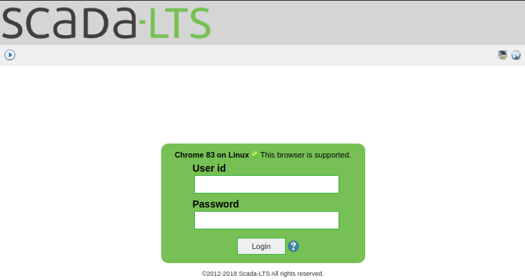
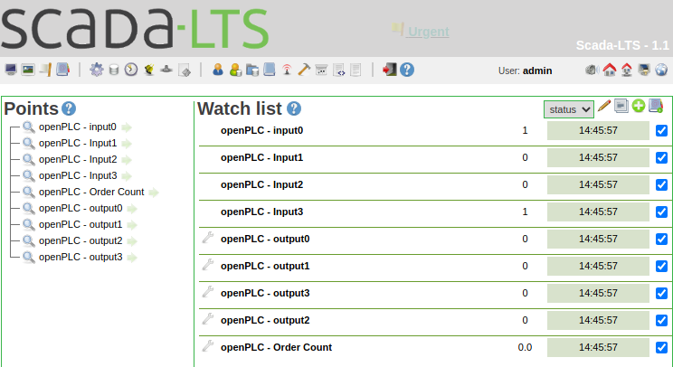
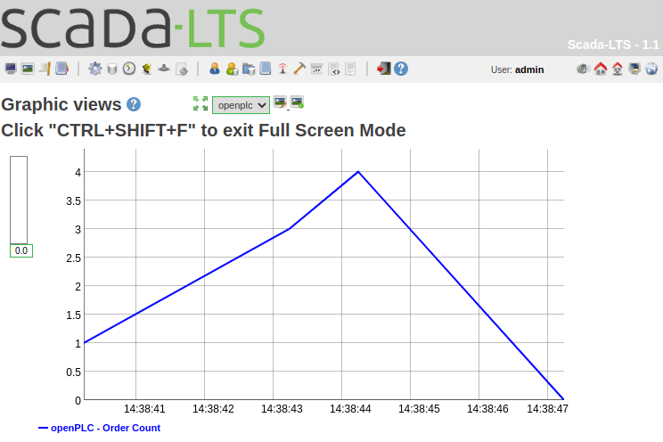

# Low-cost ICS Testbed - ScadaLTS

The standard set-up is to use the release images of each Raspberry Pi.

## Usage of SCADA ScadaLTS

ScadaLTS is not designed to run on a Raspberry Pi.
Because of this, it takes some minutes to boot.
After this, it is accesible on http.

http://192.168.0.10:8080/ScadaBR

<table align="center"><tr><td align="center" width="9999">
</img>
</td></tr></table>

The login is the default login of ScadaLTS admin:admin.

After the login, you can see the current values of the sensors and actuators.
Furthermore, the order count is displayed.

<table align="center"><tr><td align="center" width="9999">
</img>
</td></tr></table>

With the historian features of ScadaLTS you can view the historic data.
For example how the order count changes over time.

<table align="center"><tr><td align="center" width="9999">
</img>
</td></tr></table>


## Set-up ScadaLTS by your own (optional)

The set-up of ScadaLTS is difficult on a Raspberry Pi.
The recommended procedure is to use the release image!

### Configure the network interface

Configure IP Adress of the Scada Raspberry Pi.
```zsh
sudo nano /etc/network/interfaces
```

The file should look like this at the end.
With this, you will have a static IP and if possible also one from DHCP. 
```
# interfaces(5) file used by ifup(8) and ifdown(8)

# Please note that this file is written to be used with dhcpcd
# For static IP, consult /etc/dhcpcd.conf and 'man dhcpcd.conf'

# Include files from /etc/network/interfaces.d:
source-directory /etc/network/interfaces.d

auto lo eth0 eth0:0
iface lo inet loopback

iface eth0 inet dhcp

iface eth0:0 inet static
    address 192.168.0.10
    netmask 255.255.255.0

```

### Install tomcat7

Connect to the Raspberry Pi for the SCADA.
Download tomcat in version 7:
```zsh
wget https://archive.apache.org/dist/tomcat/tomcat-7/v7.0.96/bin/apache-tomcat-7.0.96.tar.gz
```

Extract the tar.gz archive:
```
sudo tar xvzf apache-tomcat-7.0.96.tar.gz
```

Create tomcat directory:
```zsh
sudo mkdir -p /opt/tomcat
sudo mv apache-tomcat-7.0.96 /opt/tomcat/
```

Install Java:
```zsh
sudo apt install default-jdk
```

Set environment variables:
```zsh
vim ~/.bashrc
```

Add the export to the bashrc:
```zsh
export JAVA_HOME=/usr/lib/jvm/java-11-openjdk-armhf
export CATALINA_HOME=/opt/tomcat/apache-tomcat-7.0.96
```

Export the bashrc:
```zsh
. ~/.bashrc
```

Edit a init.d file to start and stop the tomcat server:
```
sudo nano /etc/init.d/tomcat
```

Copy the following to the init.d tomcat file:
```
#!/bin/sh
# /etc/init.d/tomcat
# starts the Apache Tomcat service
### BEGIN INIT INFO
# Provides:          tomcat
# Required-Start:
# Required-Stop:
# Default-Start:     2 3 4 5
# Default-Stop:      0 1 6
# X-Interactive:     true
# Short-Description: Start/stop tomcat application server
### END INIT INFO
 
export CATALINA_HOME="/opt/tomcat/apache-tomcat-7.0.96"
case "$1" in
start)
  if [ -f $CATALINA_HOME/bin/startup.sh ];
  then
    echo $"Starting Tomcat"
    /bin/su root $CATALINA_HOME/bin/startup.sh
  fi
  ;;
stop)
  if [ -f $CATALINA_HOME/bin/shutdown.sh ];
  then
    echo $"Stopping Tomcat"
    /bin/su root $CATALINA_HOME/bin/shutdown.sh
  fi
  ;;
*)
  echo $"Usage: $0 {start|stop}"
  exit 1
  ;;
esac
```

Make the init.d script executable:
```
sudo chmod +x /etc/init.d/tomcat
```

Add the tomcat script to default startup:
```
sudo update-rc.d tomcat defaults
```


### Install mysql-server and configure it
Install mariadb as sql server:
```zsh
sudo apt install mariadb-server
```

```zsh
sudo mysql -p 
```
Enter your admin/root password of your server.

Create a sql database for ScadaLTS.
```sql
create database scadalts; 
```

Create username and password for ScadaLTS database.
```sql
CREATE USER 'scadalts' IDENTIFIED BY 'scadalts'; 
```

Give username admin rights to database.
```sql
GRANT ALL PRIVILEGES ON scadalts. * TO scadalts; 
```

Exit sql.
```sql
quit; 
```

### Install the SCADA-LTS WAR App
Change into the directory of the tomcat webapps installation:
```zsh
cd /opt/tomcat/apache-tomcat-7.0.96/webapps
```

Get t he current version of SCADA-LTS (do not know, why it is named ScadaBR...):
```zsh
sudo wget https://github.com/SCADA-LTS/Scada-LTS/releases/download/v2.3.2/ScadaBR.war
```

### Changing configuration of the SCADA-LTS webapp
Edit the environment properties of the SCADA-LTS webapp:
```zsh
sudo vim /opt/tomcat/apache-tomcat-7.0.96/webapps/ScadaBR/WEB-INF/classes/env.properties
```

There is already a section, which looks similar to this, delete these elemnts and replace it with the following:
```vim
db.type=mysql
db.url=jdbc:mysql://localhost:3306/scadalts
db.username=scadalts
db.password=scadalts
db.pool.maxActive=10
db.pool.maxIdle=10
```
