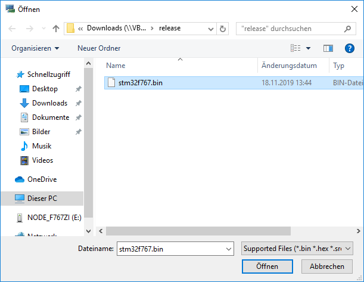
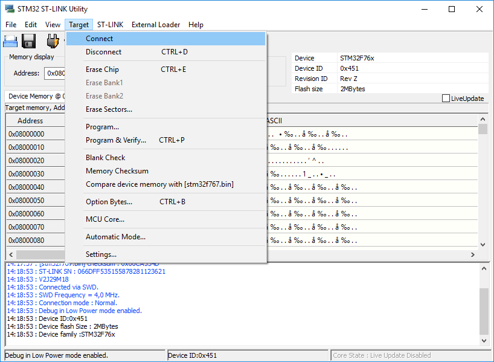

# Building and Flashing the STM32 Development Boards (OPC-UA open62541 Testing)
This setup is required for flashing the STM32 remote IO boards.
The gcc toolchain is only necessary for building custom images.

## Set-up for Ubuntu

### Installing GCC (Optional)

Easy installation of ARM gcc with apt repository:
```sh
sudo add-apt-repository ppa:team-gcc-arm-embedded/ppa
sudo apt-get update
sudo apt-get install gcc-arm-none-eabi
```

### Building (Optional)

Change into the software folder of the LICSTER remote IO:
```sh
cd $HOME/LICSTER/devices/remote_io/software
```

Build the firmware:
```sh
make -j$(nproc)
```

At the end, there must be an output like this:
```sh
   text    data     bss     dec     hex filename
 125588   12588  283172  421348   66de4 build/stm32f767.elf
arm-none-eabi-objcopy -O ihex build/stm32f767.elf build/stm32f767.hex
arm-none-eabi-objcopy -O binary -S build/stm32f767.elf build/stm32f767.bin
```

### Installing Flash Tool 

There is a github project for the stm32 discovery line to program under linux.
This is used to get the cd firmware on the remote IO boards:
```sh
sudo apt-getlibusb-1.0.0-dev stlink-tools
```

After this, connect the STM32 boards over USB to your computer and check the communication with:
***Important:*** The USB port for programming is on the other side of the PCB!
Get information about the connected STM32 boards:
```sh
sudo st-info --probe
Found 1 stlink programmers
 serial: 303636444646353335313535383738
openocd: "\x30\x36\x36\x44\x46\x46\x35\x33\x35\x31\x35\x35\x38\x37\x38"
  flash: 2097152 (pagesize: 2048)
   sram: 524288
 chipid: 0x0451
  descr: F76xxx device
```

### Flash the LICSTER Firmware
If you have build the firmware by yourself you can directly execute the "flashall" script.
Otherwise you have to rename the folder "release" into "build" bevore running the script:
```sh
mv release build
```

With the "flashall" script, every connected STM32 board gets the LICSTER firmware:
```sh
sudo ./flashall.sh 
++++++++++++++++++++++++++++++++++++++++++++++++
+ Automatic ST-FLASHER by Matthias Niedermaier +
+ Flashing all devices detected by probe       +
++++++++++++++++++++++++++++++++++++++++++++++++
Found the following devices:
303636444646353335313535383738
++++++++++++++++++++++++++++++++++++++++++++++++
Check for duplicate serial numbers?
++++++++++++++++++++++++++++++++++++++++++++++++
Flashing Device 0, with SN: 303636444646353335313535383738
++ st-flash --serial 303636444646353335313535383738 write build/stm32f767.bin 0x8000000
2019-11-18T13:45:50 INFO common.c: Loading device parameters....
2019-11-18T13:45:50 INFO common.c: Device connected is: F76xxx device, id 0x10016451
2019-11-18T13:45:50 INFO common.c: SRAM size: 0x80000 bytes (512 KiB), Flash: 0x200000 bytes (2048 KiB) in pages of 2048 bytes
2019-11-18T13:45:50 INFO common.c: Attempting to write 138184 (0x21bc8) bytes to stm32 address: 134217728 (0x8000000)
EraseFlash - Sector:0x0 Size:0x8000 EraseFlash - Sector:0x1 Size:0x8000 EraseFlash - Sector:0x2 Size:0x8000 EraseFlash - Sector:0x3 Size:0x8000 EraseFlash - Sector:0x4 Size:0x20000 2019-11-18T13:45:53 INFO common.c: Finished erasing 5 pages of 131072 (0x20000) bytes
2019-11-18T13:45:53 INFO common.c: Starting Flash write for F2/F4/L4
2019-11-18T13:45:53 INFO flash_loader.c: Successfully loaded flash loader in sram
2019-11-18T13:45:55 INFO common.c: Starting verification of write complete
2019-11-18T13:45:56 INFO common.c: Flash written and verified! jolly good!
+ OUTPUT='st-flash 1.5.1
Flash page at addr: 0x08020000 erased
enabling 32-bit flash writes
size: 32768
size: 32768
size: 32768
size: 32768
size: 7112'
+ set +x
++++++++++++++++++++++++++++++++++++++++++++++++
Totally flashed devices: 1
```

## Flashing under Windows

Download the [STM32 ST-LINK Utility](https://www.st.com/en/development-tools/stsw-link004.html) from STMicroelectronics and install it.
*Important:* Allow the installation of the drivers for the STM32.

"File" -> "Open File"
<table align="center"><tr><td align="center" width="9999">
</img>
</td></tr></table>

"Target" -> "Connect"
<table align="center"><tr><td align="center" width="9999">
</img>
</td></tr></table>

"Target" -> "Program & Verify"
<table align="center"><tr><td align="center" width="9999">
</img>
</td></tr></table>

<table align="center"><tr><td align="center" width="9999">
</img>
</td></tr></table>

## Testing
After the STM32 is flashed, it should start the LICSTER firmware:
* Startup is several seconds to ensure that the NW switch is up
* Blue LED is blinking with about 2 Hz
* Display should work
* UART over USB with 115200 baud
* Ping possible without LICSTER shield (192.168.0.50)

By connecting over serial, the STM32 should print out some information during the boot.
For this the default USB port, which is also used for programming is used.
```sh
sudo picocom -b 115200 /dev/ttyACM0
+++++++++++++++++++++++++++++++++++++++
Build: Nov 18 201913:43:29
LOGLEVEL set to: 0!
Init done!
Error: No shield connected!
DeviceID: 0
DeviceSE: 134232837
Starting Scheduler!
LED Toggle Task started
MAC Address: 00:80:e1:00:00:00 
IP Address set to: 192.168.000.050
Starting httpd!
Starting iperf task - Not necessary in production
Logging Task started!
DEB: modbus_cmd_handler_task(Src/modbus_handler.c:182) Creating modbus_cmd_handler_task.
DEB: modbus_cmd_handler_task(Src/modbus_handler.c:199) Before netconn_accept.
DEB: httpd_task(Src/http.c:92) Starting HTTPD
```

## Build with OPC-UA open62541

### Configure and build single file of open62541
Checkout the open62541 GIT

```
git clone https://github.com/open62541/open62541
```

Change into open62541 directory

```
cd open62541
```

Build the single file to use it (Build will fail).
https://open62541.org/doc/current/building.html#freertos-lwip
```
cmake -DUA_ARCHITECTURE=freertosLWIP -DUA_ENABLE_AMALGAMATION=ON ./
make
```

Use the graphical cmake GUI
```
ccmake ./
```

### Configure LwIP

```
#define LWIP_COMPAT_SOCKETS 0 // Don't do name define-transformation in networking function names.
#define LWIP_SOCKET 1 // Enable Socket API (normally already set)
#define LWIP_DNS 1 // enable the lwip_getaddrinfo function, struct addrinfo and more.
#define SO_REUSE 1 // Allows to set the socket as reusable
#define LWIP_TIMEVAL_PRIVATE 0 // This is optional. Set this flag if you get a compilation error about redefinition of struct timeval
```

### Configure FreeRTOS

```
#define configCHECK_FOR_STACK_OVERFLOW 1
#define configUSE_MALLOC_FAILED_HOOK 1
```

## Configure Makefile

Add architecture to C_FLAGS


