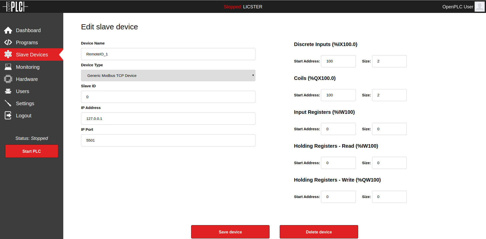

# Secure Layer
This software component manages modbus connections wrapped in TLS.

1. [Requirements](#requirements)
2. [TLS](#tls)
   1. [What is TLS?](#what-is-tls)
   2. [How can LICSTER utilize TLS?](#how-can-licster-utilize-tls)
3. [Setup](#setup)
   1. [Creating Certificates](#creating-certificates)
   2. [Remote IO](#remote-io)
   3. [OpenPLC](#openplc)
4. [Bridge Manager](#bridge-manager)
   1. [What is the Bridge Manager?](#what-is-the-bridge-manager)
   2. [Running the Bridge Manager](#running-the-bridge-manager)
   3. [Removing the Bridge Manager](#removing-the-bridge-manager)
   4. [Additional configuration (Optional)](#additional-configuration-optional)

## Requirements   

A running and functional LICTSTER Testbed.
RemoteIOs connected to the OpenPLC Raspberry Pi over USB/Power.
   
## TLS
### What is TLS?
Transport Layer Security, and its now-deprecated predecessor, Secure Sockets Layer, are cryptographic protocols designed to provide communications security over a computer network. Several versions of the protocols find widespread use in applications such as web browsing, email, instant messaging, and voice over IP.

### How can LICSTER utilize TLS?
By wrapping the modbus connection inside a TLS connection, ensure the authenticity of the modbus server we connect to, prevent other parties from eavesdropping the unencrypted communication, but also prevent MITM attacks!

## Setup
In order to make use of the TLS protocol we have to set up all our modbus components to use TLS:

### SSH to the OpenPLC Raspberry Pi

Login to the Raspberry Pi over SSh with pi:raspberry.

```sh
ssh pi@192.168.0.30
```

### Creating Certificates
In order to make use of TLS we need certificates. Instead of using a public certificate authority (CA) to sign our certificates we create one local CA known as LICSTER. All devices presenting certificates signed by this local CA are to be seen as trustworthy.  
To create a new CA together with all the signed certificates do the following:

**Warning:** This will replace all previously generated certificates (including the CA)!

```sh
cd $HOME/gits/LICSTER/tools
chmod +x cert_write create_new_certs_with_ca.sh gen_key
./create_new_certs_with_ca.sh
```

### Remote IO
**Important:** In order to build in TLS mode you need to first create corresponding certificates!
[Read this](/devices/remote_io/software/README.md) for information about the Remote IO.

#### Building TLS firmware

Change into the software folder of the LICSTER remote IO:
```sh
cd $HOME/gits/LICSTER/devices/remote_io/software
```

Build the firmware:
```sh
make clean
make -j$(nproc) config=tls
```

At the end, there must be an output like this:
```sh
   text    data     bss     dec     hex filename
 125588   12588  283172  421348   66de4 build/stm32f767.elf
arm-none-eabi-objcopy -O ihex build/stm32f767.elf build/stm32f767.hex
arm-none-eabi-objcopy -O binary -S build/stm32f767.elf build/stm32f767.bin
```

```sh
sudo ./flashall.sh 
```

### OpenPLC
[Read this](/devices/plc/README.md) for information on how to set up the OpenPLC.

#### Running the OpenPLC in TLS mode (Optional)
Follow the same instructions as in [Running the OpenPLC](#running-the-openplc), but use the following configuration for the Slave Devices.

<table align="center"><tr><td align="center" width="9999">
</img>
</td></tr></table>

<table align="center"><tr><td align="center" width="9999">
</img>
</td></tr></table>

## Bridge Manager
### What is the Bridge Manager
The Bridge Manager is the application that creates, manages and restarts these TLS wrapped modbus connections. It is written in Python.

### Running the Bridge Manager
Change into the Secure_Layer folder of the software section inside the PLC:
```sh
cd $HOME/gits/LICSTER/projects/Secure_Layer
```

Start the Bridge Manager on boot:
```sh
chmod +x add_to_autostart.sh
sudo ./add_to_autostart.sh
```

## Disable/Remove TLS 

### Building the regular remoteIO firmware

Change into the software folder of the LICSTER remote IO:
```sh
cd $HOME/gits/LICSTER/devices/remote_io/software
```

Build the firmware:
```sh
make clean
make -j$(nproc)
```

At the end, there must be an output like this:
```sh
   text    data     bss     dec     hex filename
 125588   12588  283172  421348   66de4 build/stm32f767.elf
arm-none-eabi-objcopy -O ihex build/stm32f767.elf build/stm32f767.hex
arm-none-eabi-objcopy -O binary -S build/stm32f767.elf build/stm32f767.bin
```

```sh
sudo ./flashall.sh 
```

### Removing the Bridge Manager
**Important:** Only if you want to disable TLS again.
Change into the Secure_Layer folder of the software section inside the PLC:
```sh
cd $HOME/gits/LICSTER/projects/Secure_Layer
```

Disable and remove the Bridge Manager from the boot procedure:
```sh
chmod +x remove_from_autostart.sh
sudo ./remove_from_autostart.sh
```


### Additional configuration (Optional)
The Bridge Manager has a few options that can be configured. For more inforation check out its [configuration file](config.ini)
